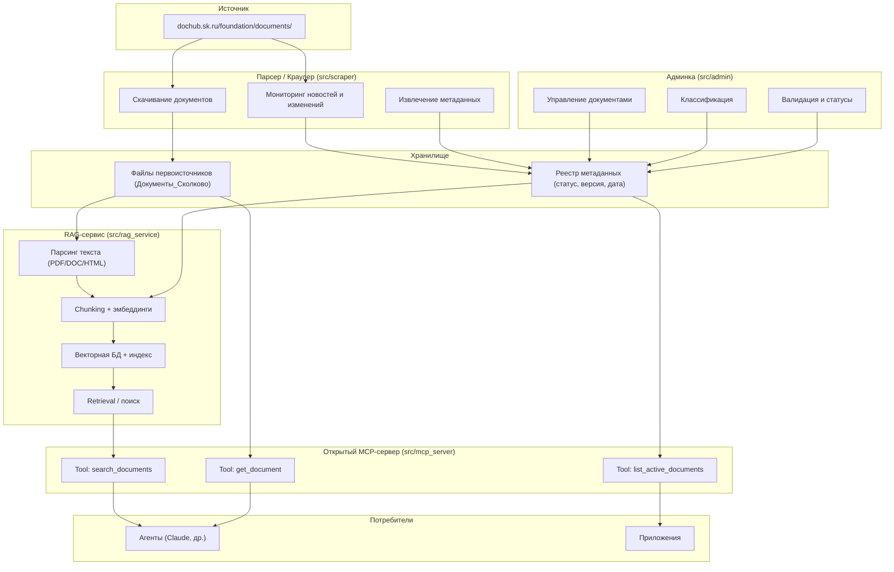
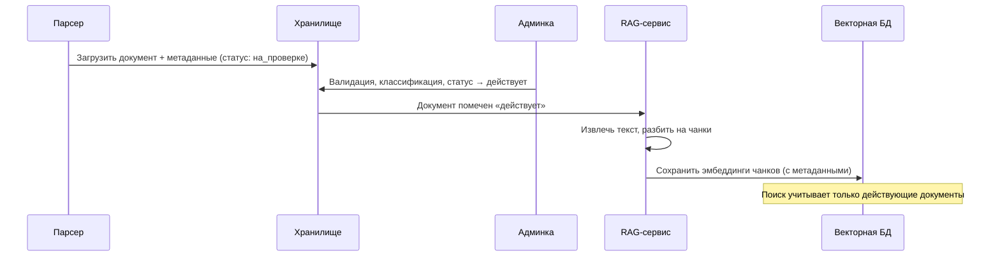
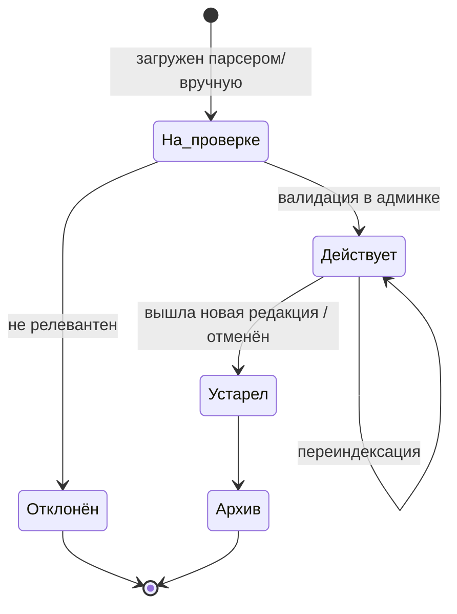
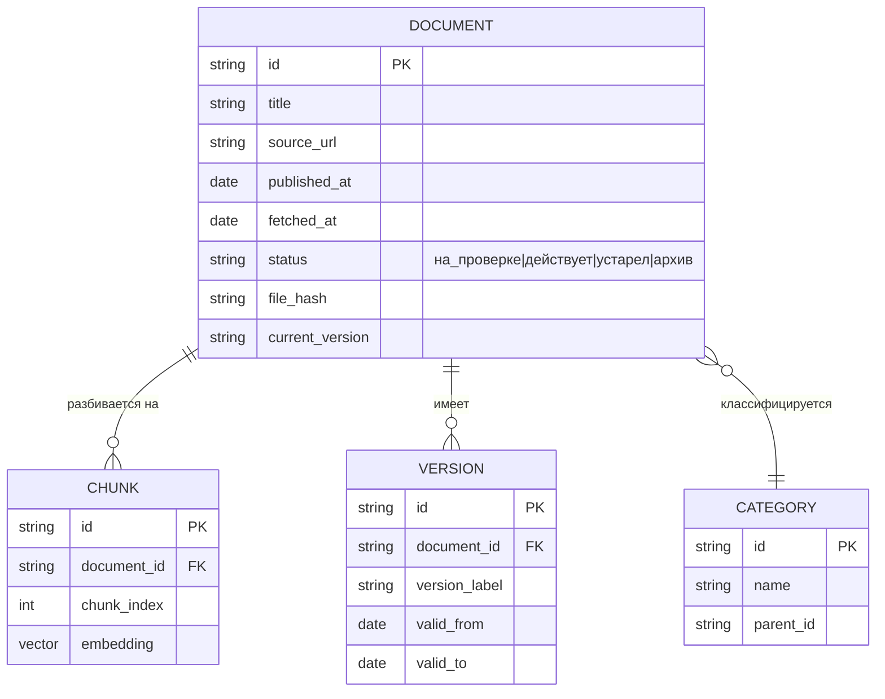
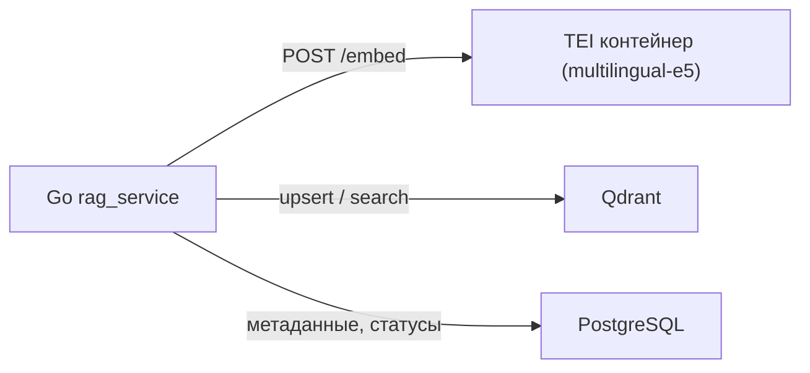

# Архитектура системы «База Сколково»

**Версия:** 0.3 (черновик)

**Дата:** 29.05.2026

**Статус:** MVP реализован, источник разведан (Telligent/RSS/WAF)

---

## 1. Цель

Сервис собирает документы и материалы Фонда «Сколково», обрабатывает их в RAG-базу и отдаёт агентам/приложениям через **открытый MCP-сервер**, поддерживая актуальность через регулярный парсинг сайта-источника.

**Источник:** https://dochub.sk.ru/foundation/documents/

---

## 2. Компонентная архитектура

---

## 3. Пайплайн обработки документа (RAG)

---

## 4. Жизненный цикл документа

---

## 5. Модель метаданных документа

---

## 6. Принятые решения (29.05.2026)

| # | Вопрос | Решение |
| :--- | :--- | :--- |
| 1 | Язык/стек бэкенда | **Go 1.25** |
| 2 | Векторная БД | **Qdrant** (Docker, фильтрация по метаданным) |
| 3 | Эмбеддинги | **Локальные multilingual-e5** через HuggingFace **TEI** (Docker), Go → HTTP |
| 4 | Транспорт MCP | **Streamable HTTP** |
| 5 | Доступ к MCP | **Открытый + API-ключ**, rate-limit |
| 6 | Реестр метаданных / БД админки | **PostgreSQL** |
| 7 | Админка | Go-сервис (HTML + htmx) — единый стек; React как опция при росте требований |

### Почему TEI для эмбеддингов

В Go нет зрелого нативного inference для e5. TEI — официальный сервер инференса HuggingFace: поднимается контейнером, отдаёт эмбеддинги по HTTP `/embed`. Go-бэкенд остаётся тонким клиентом, модель меняется без правок кода. Абстракция `Embedder` в `src/common` позволит при необходимости заменить TEI на внешний API.

---

## 7. Результаты разведки источника (29.05.2026)

Сайт dochub.sk.ru работает на платформе **Telligent Evolution 7.6**. Установлено:

- Список документов в HTML-страницах **не отдаётся** — грузится AJAX-виджетом `superlist`.
- Есть **RSS-лента-каталог** документов: `…/foundation/documents/rss.aspx` — отдаёт заголовки («File: …»), ссылки на страницы-просмотрщики `/m/docs/<id>.aspx`, даты. **Это основной источник каталога.**
- Страницы документов `/m/docs/<id>.aspx` и файлы за ними закрыты **WAF (HTTP 403)** для не-браузерных клиентов (cookie/Referer/UA не помогают).
- В заголовках встречается прямое «УТРАТИЛИ СИЛУ» — используется для авто-статуса «устарел».
- robots.txt: **Crawl-delay 3 c** — соблюдается парсером.

**Решение:** парсер заводит документы в каталог из RSS (метаданные, статус «на_проверке»/«устарел»), тело файла оставляется пустым. Скачивание тел файлов требует headless-браузера (chromedp/Playwright) или официального доступа — отдельная задача бэклога.

## 8. Открытые вопросы

- Скачивание тел файлов из-под WAF (headless-браузер или доступ/API Фонда).
- Конкретная модель e5: `multilingual-e5-base` (быстрее) или `-large` (точнее).
- Полнота RSS-каталога: все документы или только последние N (проверить пагинацию / по-категорийные ленты).

---

*Документ v0.3. Обновлён по результатам разведки источника. Дата: 29.05.2026.*
