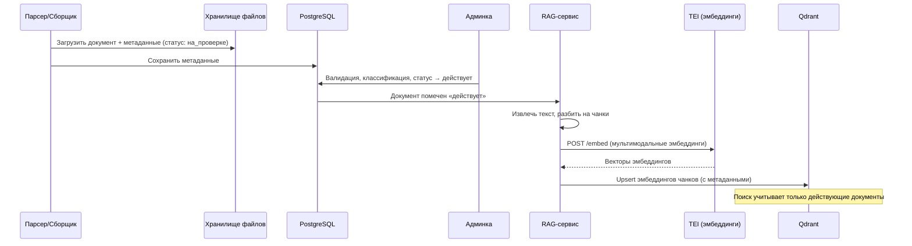
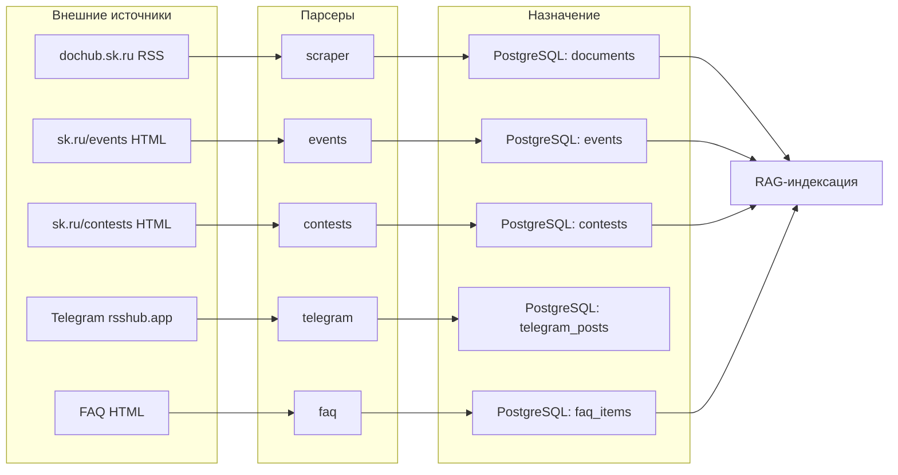
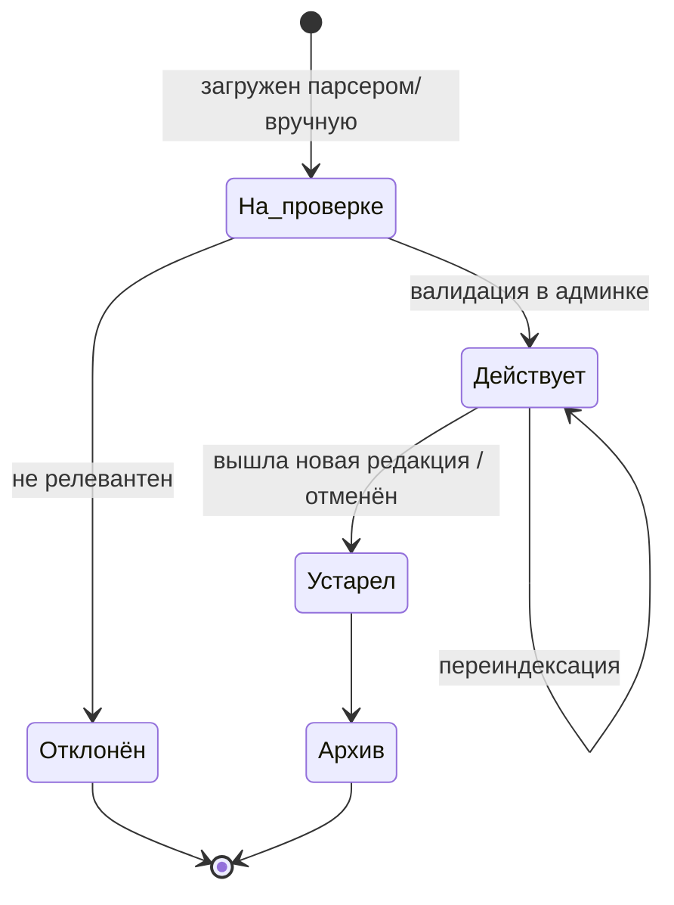
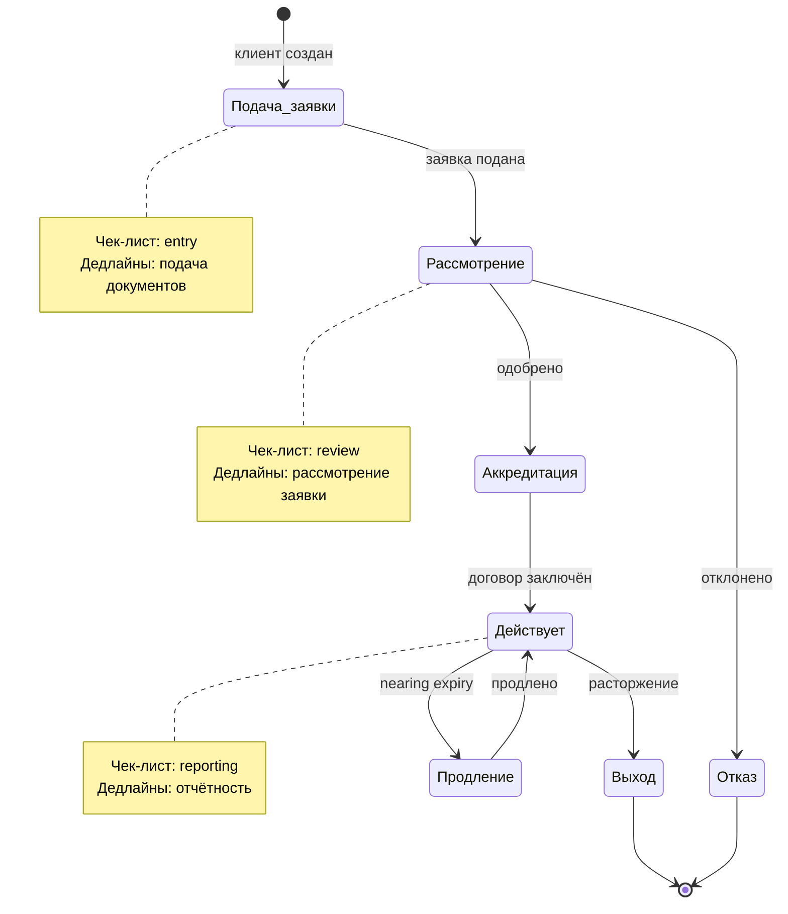
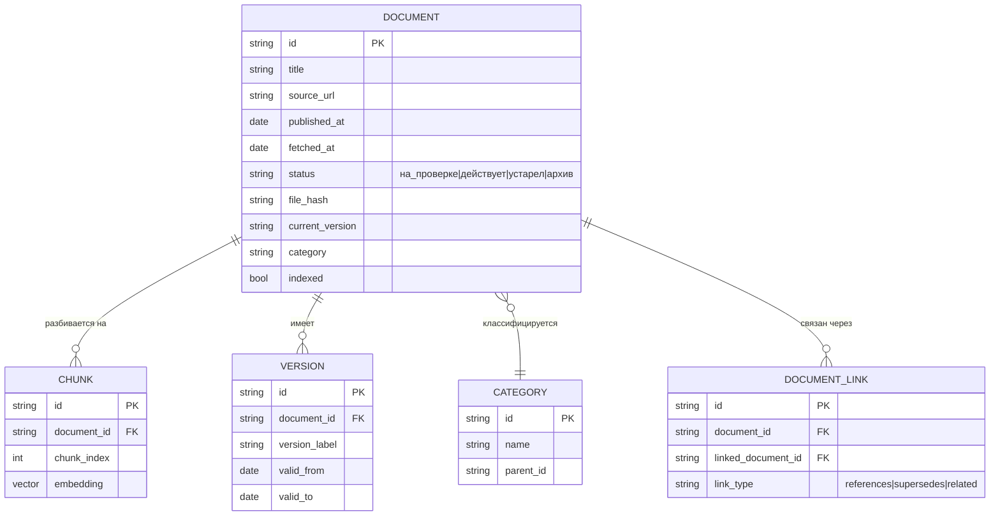
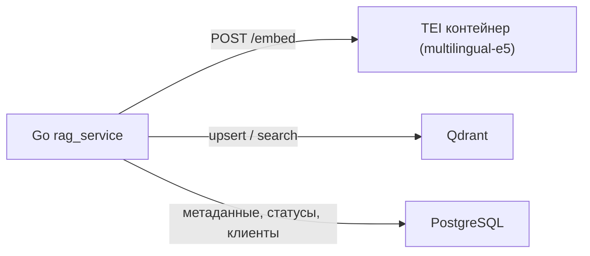

# Архитектура системы «База Сколково»

**Версия:** 1.0

**Дата:** 29.05.2026

**Статус:** MVP v1.0 реализован (парсер → RAG → MCP → админка → планировщик → резидентство → Telegram-бот → аналитика)

---

## 1. Цель

Сервис собирает документы и материалы Фонда «Сколково», обрабатывает их в RAG-базу и отдаёт агентам/приложениям через **открытый MCP-сервер**. Дополнительно система управляет **жизненным циклом резидентов** (клиенты, стадии, чек-листы, дедлайны) и предоставляет **Telegram-бот** для клиентов. Поддерживается актуальность через регулярный парсинг сайта-источника и дополнительных каналов.

**Источники:**
- https://dochub.sk.ru/foundation/documents/ (RSS)
- https://dochub.sk.ru/events/ (HTML)
- https://sk.ru/contests, https://sk.ru/grants (HTML)
- Telegram-каналы через rsshub.app
- Админка (ручной ввод)

---

## 2. Компонентная архитектура

```mermaid
flowchart TD
    subgraph SOURCES["Источники данных"]
        D1["dochub.sk.ru RSS"]
        D2["dochub.sk.ru/events HTML"]
        D3["sk.ru/contests, /grants HTML"]
        D4["Telegram-каналы (rsshub)"]
        D5["FAQ-страницы HTML"]
    end

    subgraph COLLECTORS["Сборщики данных"]
        P1["scraper — парсер документов"]
        P2["events — мероприятия"]
        P3["contests — конкурсы/гранты"]
        P4["telegram — посты Telegram"]
        P5["faq — FAQ-элементы"]
        P6["news — новости RSS"]
    end

    subgraph STORE["Хранилище"]
        F1["Файлы первоисточников"]
        PG["PostgreSQL"]
        QD["Qdrant (векторная БД)"]
    end

    subgraph CORE["Ядро системы"]
        R1["rag_service — chunking + эмбеддинги"]
        TEI["TEI контейнер (multilingual-e5)"]
        V1["validator — проверка полноты"]
        D6["diff — сравнение версий"]
        A1["analytics — метрики и дашборды"]
    end

    subgraph MCP["MCP-сервер (Streamable HTTP)"]
        X1["search_documents"]
        X2["get_document"]
        X3["list_active_documents"]
        X4["search_events"]
        X5["search_contests"]
        X6["search_faq"]
        X7["search_residents"]
        X8["get_document_links"]
    end

    subgraph RESIDENCY["Управление резидентством"]
        C1["ClientStore — клиенты"]
        C2["ChecklistStore — чек-листы"]
        C3["DeadlineStore — дедлайны"]
        C4["TemplateStore — шаблоны"]
        R2["MCP-инструменты резидентства"]
    end

    subgraph BOT["Telegram-бот"]
        B1["tgbot — /start, /status, /deadlines, /docs, /ask, /help"]
    end

    subgraph ADM["Админка"]
        A2["Управление документами"]
        A3["Классификация"]
        A4["Валидация и статусы"]
    end

    subgraph SCHED["Планировщик"]
        S1["scheduler — cron-задачи"]
        S2["pipeline — конвейер актуализации"]
        S3["notify — уведомления"]
    end

    subgraph MIGRATE["Миграции"]
        M1["migrate — схема PostgreSQL"]
    end

    subgraph CLIENTS["Потребители"]
        CA["Агенты (Claude, др.)"]
        CB["Приложения"]
        CC["Клиенты резидентства (Telegram)"]
    end

    %% Потоки данных
    D1 --> P1 --> F1
    D2 --> P2
    D3 --> P3
    D4 --> P4
    D5 --> P5
    D6 --> P6

    P2 --> PG
    P3 --> PG
    P4 --> PG
    P5 --> PG
    P6 --> PG

    F1 --> R1
    R1 -->|"POST /embed"| TEI
    R1 -->|"upsert"| QD

    F1 --> PG
    PG --> A4
    PG --> A2
    PG --> A3

    PG --> X1
    QD --> X1
    PG --> X2
    PG --> X3
    PG --> X4
    PG --> X5
    PG --> X6
    PG --> X7
    PG --> X8

    PG --> C1
    PG --> C2
    PG --> C3
    PG --> C4
    C1 --> R2
    C2 --> R2
    C3 --> R2
    C4 --> R2

    C1 --> B1
    C2 --> B1
    C3 --> B1

    PG --> A1
    QD --> A1
    C1 --> A1
    C3 --> A1

    M1 --> PG

    S1 --> S2
    S2 --> P1
    S2 --> P2
    S2 --> P3
    S2 --> P4
    S2 --> P5
    S2 --> P6
    S2 --> S3

    X1 --> CA
    X2 --> CA
    X3 --> CB
    X4 --> CA
    X5 --> CA
    X6 --> CA
    X7 --> CA
    X8 --> CA
    R2 --> CB
    B1 --> CC
```

---

## 3. ER-модель

```mermaid
erDiagram
    DOCUMENT ||--o{ CHUNK : "разбивается на"
    DOCUMENT ||--o{ VERSION : "имеет"
    DOCUMENT }o--|| CATEGORY : "классифицируется"
    DOCUMENT ||--o{ DOCUMENT_LINK : "связан через"
    DOCUMENT ||--o{ EVENT : "относится к"
    DOCUMENT ||--o{ CONTEST : "относится к"
    DOCUMENT ||--o{ FAQ_ITEM : "относится к"

    DOCUMENT {
        string id PK
        string title
        string source_url
        string local_path
        date published_at
        date fetched_at
        string status "на_проверке|действует|устарел|архив"
        string category
        string file_hash
        string current_version
        bool indexed
    }
    VERSION {
        string id PK
        string document_id FK
        string version_label
        date valid_from
        date valid_to
    }
    CATEGORY {
        string id PK
        string name
        string parent_id
    }
    CHUNK {
        string id PK
        string document_id FK
        int chunk_index
        vector embedding
    }
    DOCUMENT_LINK {
        string id PK
        string document_id FK
        string linked_document_id FK
        string link_type "references|supersedes|related"
    }
    EVENT {
        string id PK
        string title
        string description
        date event_date
        date event_end_date
        string location
        string source_url
        string status "active|past"
        string category
    }
    CONTEST {
        string id PK
        string title
        string description
        date start_date
        date end_date
        string requirements
        string prize
        string source_url
        string status "active|closed|winner_selected"
        string category
    }
    FAQ_ITEM {
        string id PK
        string question
        string answer
        string category
        string source_url
    }
    TELEGRAM_POST {
        string id PK
        string channel
        string text
        datetime published_at
        string source_url
    }

    CLIENT ||--o{ STAGE_TRANSITION : "имеет"
    CLIENT ||--o{ CLIENT_CHECKLIST : "имеет"
    CLIENT ||--o{ DEADLINE : "имеет"
    CLIENT ||--o{ CLIENT_DOCUMENT : "имеет"
    CLIENT }o--|| TEMPLATE : "использует"

    CLIENT {
        string id PK
        string name
        string inn
        string contact_email
        string contact_phone
        string tenant_id
        string residency_stage
        datetime created_at
        datetime updated_at
    }
    STAGE_TRANSITION {
        string id PK
        string client_id FK
        string from_stage
        string to_stage
        datetime transitioned_at
        string notes
    }
    CHECKLIST_TEMPLATE {
        string id PK
        string title
        string procedure_type "entry|reporting|extension|exit"
    }
    CHECKLIST_STEP {
        string id PK
        string checklist_id FK
        int step_index
        string description
    }
    CLIENT_CHECKLIST {
        string id PK
        string client_id FK
        string checklist_id FK
        string status "in_progress|completed"
    }
    CHECKLIST_STEP_STATUS {
        string id PK
        string client_checklist_id FK
        int step_index
        string status "pending|in_progress|completed|skipped"
        string notes
    }
    DEADLINE {
        string id PK
        string client_id FK
        string title
        datetime due_date
        string status "pending|completed|overdue"
        string checklist_id FK
    }
    TEMPLATE {
        string id PK
        string title
        string template_type
        string content
    }
    CLIENT_DOCUMENT {
        string id PK
        string client_id FK
        string document_id FK
        string status "draft|submitted|approved|rejected"
        datetime uploaded_at
    }

    RESIDENT {
        string id PK
        string name
        string inn
        string industry
        string status "active|inactive"
        datetime registered_at
    }
```

---

## 4. Пайплайн обработки документа (RAG)

### Дополнительные источники данных

---

## 5. Жизненный цикл документа

## 6. Жизненный цикл резидентства клиента

---

## 7. Модель метаданных документа (базовая)

---

## 8. Принятые решения (29.05.2026)

| # | Вопрос | Решение |
| :--- | :--- | :--- |
| 1 | Язык/стек бэкенда | **Go 1.26** |
| 2 | Векторная БД | **Qdrant** (Docker, фильтрация по метаданным) |
| 3 | Эмбеддинги | **Локальные multilingual-e5** через HuggingFace **TEI** (Docker), Go → HTTP |
| 4 | Транспорт MCP | **Streamable HTTP** |
| 5 | Доступ к MCP | **Открытый + API-ключ**, rate-limit по IP |
| 6 | Реестр метаданных / БД админки | **PostgreSQL** (также БД резидентства: клиенты, чек-листы, дедлайны) |
| 7 | Админка | Go-сервис (HTML + htmx) — единый стек |
| 8 | Headless-браузер | **chromedp** — для скачивания тел файлов из-под WAF |
| 9 | Telegram-бот | **go-telegram-bot-api/v5** — polling mode для клиентов резидентства |
| 10 | Аналитика | Встроенный модуль, HTML-дашборд с **Chart.js**, экспорт в CSV |
| 11 | Diff документов | **LCS-алгоритм** (longest common subsequence), HTML-вывод с подсветкой |
| 12 | Миграции БД | Встроенный пакет `migrate`, SQL-скрипты |
| 13 | Telegram-каналы | **rsshub.app** как RSS-агрегатор; fallback на stub с инструкцией |

### Почему TEI для эмбеддингов

В Go нет зрелого нативного inference для e5. TEI — официальный сервер инференса HuggingFace: поднимается контейнером, отдаёт эмбеддинги по HTTP `/embed`. Go-бэкенд остаётся тонким клиентом, модель меняется без правок кода. Абстракция `Embedder` в `src/common` позволит при необходимости заменить TEI на внешний API.

---

## 9. Результаты разведки источника (29.05.2026)

Сайт dochub.sk.ru работает на платформе **Telligent Evolution 7.6**. Установлено:

- Список документов в HTML-страницах **не отдаётся** — грузится AJAX-виджетом `superlist`.
- Есть **RSS-лента-каталог** документов: `…/foundation/documents/rss.aspx` — отдаёт заголовки («File: …»), ссылки на страницы-просмотрщики `/m/docs/<id>.aspx`, даты. **Это основной источник каталога.**
- Страницы документов `/m/docs/<id>.aspx` и файлы за ними закрыты **WAF (HTTP 403)** для не-браузерных клиентов (cookie/Referer/UA не помогают).
- В заголовках встречается прямое «УТРАТИЛИ СИЛУ» — используется для авто-статуса «устарел».
- robots.txt: **Crawl-delay 3 c** — соблюдается парсером.
- **chromedp** подключён для headless-браузера — позволяет обходить WAF при необходимости.

**Решение:** парсер заводит документы в каталог из RSS (метаданные, статус «на_проверке»/«устарел»), тело файла оставляется пустым. Скачивание тел файлов через chromedp — опционально.

---

## 10. Открытые вопросы

- Полнота RSS-каталога: все документы или только последние N (проверить пагинацию / по-категорийные ленты).
- Конкретная модель e5: `multilingual-e5-base` (быстрее) или `-large` (точнее).
- Настройка Telegram Bot API для production (webhook vs polling).
- Интеграция аналитики с внешними системами мониторинга (Grafana и т.д.).

---

*Документ v1.0. Обновлён по результатам реализации MVP v1.0. Дата: 29.05.2026.*
