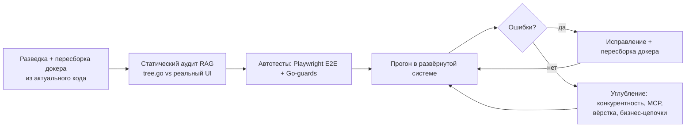

# ОТЧЁТ: QA-тестирование сайта «База Сколково» (v1.0, 02.06.2026)

> Полный цикл тестирования всех веб-интерфейсов: статический аудит RAG-навигации,
> браузерные E2E-тесты, Go-тесты, аудит конкурентности, проверка MCP-инструментов,
> цикл «нашёл ошибку → исправил → пересобрал докер → перетестил».

## 1. Резюме и вердикт

Проверены **все 7 интерфейсов** (Портал :8092, Чат-виджет :8093, Дашборд консультанта :8094,
Резидентство-Админ :8091, Главная Админ-панель :8090, MCP :8080, Telegram-бот) — каждая страница,
вкладка, блок и надпись сверены с реальным рендером.

**Итог:** найдено и исправлено **7 классов дефектов** (2 критических, 2 высоких, 3 средних/низких),
все исправления закоммичены и проверены в развёрнутом docker-compose. Финальные прогоны:

| Набор | Результат |
| :--- | :--- |
| Playwright E2E (render-integrity + layout + business-logic) | **85 / 85 PASS** |
| Go-тесты (весь модуль, 31 пакет, вкл. интеграционные `tests/`) | **PASS** |
| Аудит конкурентности (re-entrant mutex / lock-in-IO / blocking GET) | чисто (1 low-инфо) |
| MCP-инструменты (36 шт., вызов с пустыми аргументами) | graceful, без 5xx/паник |
| RAG-навигация (`skolkovo_navigation`) | 162 узла, синхронна с `Tree()`, без сирот |

Критический результат: **Личный кабинет клиента (Портал) был полностью нерабочим в авторизованном
режиме** (3 страницы отдавали 0 байт, дашборд обрывался) — исправлено и подтверждено в браузере.

## 2. Объём и методология

Тестирование велось мульти-агентно и итеративно:



- **Инфраструктура:** docker-compose `baza-skolkovo` (skolkovo + postgres + qdrant + tei). Образ был
  устаревшим (собран 31.05, код от 02.06) — **пересобран из рабочего дерева**; миграции 008–010
  применились, появилась недостающая коллекция `skolkovo_sitepages`, переиндексирована навигация.
- **Статический аудит:** сверка `src/navindex/tree.go` (источник истины RAG) с рендерящим Go-кодом по
  каждому интерфейсу + состязательная верификация находок → **73 подтверждённых расхождения** (5 высоких).
- **Браузерные тесты:** Playwright (headless Chromium) — новый набор в `tests/e2e/`.
- **Go-тесты:** добавлены guard-тесты + прогон всего модуля.
- **Цикл исправлений:** каждое исправление → `go build/vet/test` → пересборка `skolkovo` → перепроверка
  в браузере и через MCP.

## 3. Полнота и точность RAG-навигации

Требование: вся структура сайта (страница → вкладка → блок → надпись + «как попасть») должна быть в
специализированной RAG-базе для ИИ-чат-бота и агентов навигации.

- Источник истины — `src/navindex/tree.go` (7 интерфейсов, ~42 страницы). Сверка показала, что **структура
  страниц/маршрутов и сайдбары — полные и корректные**; расхождения были на уровне надписей/вкладок/пустых
  состояний (60 правок `fix-tree`) + несколько отсутствующих блоков.
- **Применены все 60 `fix-tree`-находок** (коммит `c068598`): исправлены/добавлены/удалены надписи во всех
  7 интерфейсах; добавлены пропущенные блоки (фильтры `/events-admin`, `/contests-admin` со вкладкой
  «Определён победитель»; счётчики `/deadlines`; страница `/health` MCP); убраны несуществующие надписи
  (`/templates` «фильтр по типу», `/chat` «Shift+Enter», emoji «🏛» на логине). Регенерированы
  `RAG_Структура_сайта.md` и `navigation.json`; guard `TestGeneratedArtifactsUpToDate` проходит.
- **Идемпотентность индекса (коммит `f32dd96`):** `Reindex` раньше только upsert-ил — точки удалённых/
  переименованных блоков оставались «сиротами» (бот мог вернуть несуществующую надпись). Добавлена
  очистка `pruneStale`. После пересборки Qdrant `skolkovo_navigation` = **162 узла = ровно набору из
  `Tree()`** (раньше 172 с сиротами).
- **Цепочка чат-бота проверена:** `get_navigation` возвращает структурировано `interface/port/route/
  page_title/block/howto/score` — то есть «где это и как попасть». Пример: запрос «управление прокси» →
  топ-результат `/proxy` :8090 + «Пункт меню „Прокси / VPN“».

## 4. Найденные и исправленные дефекты

| # | Severity | Дефект | Корень | Исправление | Коммит | Проверка |
| :--- | :--- | :--- | :--- | :--- | :--- | :--- |
| 1 | **Критич.** | Портал ЛК: `/checklists`, `/deadlines`, `/documents` отдавали **0 байт**, `/dashboard` обрывался; страницы рендерились без CSS/шапки/меню | Рефакторинг отвязал страницы от layout; шаблоны ссылались на несуществующие поля моделей (`.Client.Email`, `.Client.StageProgress`, `.Flash`, `.StatusClass` и т.п.) | Обёртка `shell_top/shell_bottom`; `.ContactEmail`, функции `stageProgress/stageLabel`, обогащение чек-листов/дедлайнов/документов в view-модели; `Flash/FlashKind/Page` в data-структуры; guard `render_test.go` | `3fad4a9` | Все 6 страниц 200, полный HTML, без ошибок шаблонов (пустые и заполненные данные) |
| 2 | **Критич.** | `/proxy` (:8090) **зависал** (>45 c, timeout) | Само-блокировка: `save()` брал `pm.mu`, вызываясь из методов, уже державших `mu` (sync.Mutex не рекурсивный) — авто-поиск прокси при старте намертво держал лок | `save()` → `saveLocked()` (без внутреннего Lock); `load()` берёт лок в начале; guard-тест | `1a7aee6` | GET `/proxy` теперь 200 за ~6 мс |
| 3 | **Высокий** | RAG-навигация расходилась с UI (60 надписей/блоков) | Дрейф `tree.go` после рефакторингов UI | Все `fix-tree`-правки + регенерация артефактов | `c068598` | `TestGeneratedArtifactsUpToDate` PASS; реиндекс 162 |
| 4 | **Высокий** | `/ai/agents`: нельзя создать агента типа «Аннотатор страниц» (форма не предлагала тип, хотя он в enum и сидируется) | Форма не обновлена при добавлении `page_annotator` | Добавлены `<option>` и кнопка-пресет (дефолтный промпт уже был) | `3e3b879` | `/ai/agents/new` содержит `value="page_annotator"` |
| 5 | **Средний** | MCP `create_client` падал (`tenant_id NOT NULL`); `list_clients` требовал `tenant_id`; в БД 2 дубля «Default» | Нет идемпотентного дефолт-тенанта; инструменты не задавали дефолт | `store.GetOrCreateDefaultTenant` (get-or-create); `create_client` с пустым `tenant_id` → дефолт; `list_clients` принимает пустой; форма `/tenants` идемпотентна | `d57ada8` | `create_client {name,inn}` без tenant_id → 200 |
| 6 | **Средний** | Вёрстка: панель «Свежесть источников» (`/changes`) переполняла страницу **на десктопе**; фильтры/тулбар не адаптивны на мобильном | `min-width:auto` у flex/grid-элементов + длинная строка ошибки прокси растягивала grid; `.filter-tabs` без `flex-wrap` | `min-width:0` + ellipsis на health-карточках; `flex-wrap`/`min-width:0` на фильтрах; адаптив тулбара | `46b2184` | E2E layout-overflow 54/54 (десктоп+мобайл) |
| 7 | **Низкий** | Реиндекс навигации оставлял «сироты» (см. §3) | `Reindex` без удаления | `pruneStale` | `f32dd96` | Qdrant = 162, без сирот |

Дополнительно поставлены автотесты: `test(e2e)` — коммит `80ca956`.

## 5. Поставленные автотесты (артефакты)

**Go (в дереве пакетов):**
- `src/portal/render_test.go` — исполнение всех шаблонов ЛК (пустые/заполненные данные), запрет фрагментов без `</html>`/`<nav>` (ловит дефект #1).
- `src/admin/proxy_manager_test.go` — `TestProxyManagerMutateNoDeadlock` (ловит дефект #2).
- `src/common/store/default_tenant_test.go` — идемпотентность дефолт-тенанта (дефект #5).

**Playwright (`tests/e2e/`):**
- `specs/render-integrity.spec.ts` — логин в каждый интерфейс, открытие каждой страницы, проверка полного
  рендера без маркеров ошибок шаблона/сервера + наличие навигации (27 кейсов).
- `specs/layout-overflow.spec.ts` — «нет кривых страниц, текст помещается»: для каждой страницы на десктопе
  и мобильном — нет видимого горизонтального переполнения и обрезанного текста (54 кейса).
- `specs/business-logic.spec.ts` — сквозные цепочки: сохранение подписок ЛК, сессия+сообщение чата,
  `check_eligibility`, `get_navigation` (маршрут+«как попасть»).
- `support/pages.ts` — каталог всех HTML-страниц (инвентарь); `support/auth.ts` — логин (cookie/BasicAuth/
  magic-link); `support/config.ts` — порты/креды (с дев-значениями по умолчанию, переопределяются env).

Полные пошаговые тест-кейсы (ручные + браузерные) — см. сопроводительный документ
`ТЕСТКЕЙСЫ_Полные_по_интерфейсам_v1_0_02_06_2026.md`.

## 6. Остаточные риски и рекомендации

1. **Подсветка элемента в интерфейсе (feature gap).** Требование «агент находит нужную информацию в
   интерфейсе и подсвечивает её» реализовано частично: `get_navigation` отдаёт `route`+`block`+«как попасть»
   (данных достаточно для подсветки), но **deep-link с подсветкой блока в UI пока нет**. Рекомендация:
   `get_navigation` возвращает якорь/селектор блока; целевые страницы поддерживают `?hl=<block>` —
   прокрутка + кратковременная подсветка. Это отдельная фича (затрагивает 6 UI), вне объёма QA-прохода.
2. **Релевантность навигации.** На части запросов multilingual-e5 ранжирует общие результаты выше точных
   (напр. «сменить стадию клиента» → Telegram `/status` выше формы `/clients/{id}` «Сменить стадию»). Текст
   узлов уже богатый (интерфейс+страница+блок+надписи+howto); это ограничение модели. Рекомендация:
   лёгкий ре-ранкинг по точному совпадению терминов или гибрид с keyword-поиском.
3. **Чат-бот без LLM.** `QWEN_API_KEY` пуст → `ask_consultant` возвращает RAG-фрагменты, а не
   синтезированный ответ. Для полноценного бота настроить модель в `/ai/models`.
4. **Внешние источники под WAF.** `events`/`preferences`/`regulations` в `get_source_health` = `failing`
   (HTML 403 / таймаут regulation.gov.ru), `check_eligibility` не дотягивается до ЕГРЮЛ. Это сетевые/WAF
   ограничения окружения, не дефекты кода (обработаны graceful). Влияет на наполнение docs-RAG (0 тел файлов).
5. **Дубль тенанта «Default».** В БД остались 2 строки «Default» (создавались до фикса). Новые не плодятся.
   Рекомендация: разовая cleanup-миграция, схлопывающая дубли (с переносом ссылок).
6. **Тип `client_documents.document_id` (uuid) ≠ `documents.id` (40-символьный хэш).** Связать клиентский
   документ с каталожным по такому ключу нельзя (enrichment корректно деградирует на «Документ <id>»).
   Проверить замысел связи (генерируемые vs каталожные документы) и согласовать типы.
7. **Rate-limiter MCP** под всплеском возвращает HTTP 400 (местами 429) с не-JSON телом — корректнее 429
   с JSON-RPC-телом. Низкий приоритет.
8. **Сериализация сохранений краулера** (`src/sitepages/crawler.go`) под локальным мьютексом — не дедлок,
   лёгкая просадка пропускной способности фоновой волны; опционально батч-сохранение после `wg.Wait()`.

## 7. Как запускать тесты

```bash
# Go (весь модуль)
go test ./... -count=1

# Браузерные E2E (нужен поднятый docker-compose; кред-дефолты в support/config.ts, переопределяются env)
npm --prefix tests/e2e install        # один раз
npm --prefix tests/e2e run setup      # один раз: playwright install chromium
npm --prefix tests/e2e test           # все спеки
npm --prefix tests/e2e test -- layout-overflow.spec.ts   # отдельный набор
```

Пересборка сервиса после правок: `docker compose -f deploy/docker-compose.yml build skolkovo && docker compose -f deploy/docker-compose.yml up -d --wait`.

## 8. Состояние репозитория

Ветка `feat/navindex-site-navigation`. Коммиты сессии (не запушены): `3fad4a9`, `1a7aee6`, `c068598`,
`3e3b879`, `d57ada8`, `46b2184`, `f32dd96`, `80ca956`.

**Важно:** в рабочем дереве остаётся **незакоммиченная WIP-работа по `sitepages`** (`src/sitepages/*`,
`cmd/skolkovo/{main.go,sitepages_render.go}`, `src/admin/{admin.go,shell.go}`, `src/aimodels/types.go`,
`deploy/migrations/011_site_pages_published.sql`, `src/common/{config,qdrant}/*`) — это незавершённая работа
на ветке, **не трогалась** в этом QA-проходе (докер собирался из неё как «актуальный код»; весь модуль
компилируется и тесты проходят). Фикс #4 (`page_annotator` в форме) опирается на enum `page_annotator` из
этого WIP `types.go` — при откате WIP опцию формы нужно будет убрать.
