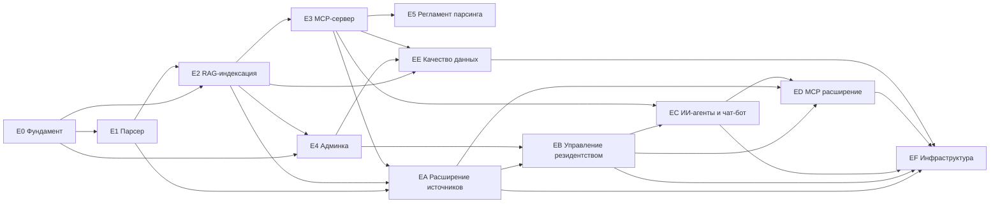

# Бэклог разработки «База Сколково»

**Версия:** 2.0

**Дата:** 29.05.2026

---

## Эпики

## Эпики (детальные документы)

| Эпик | Документ |
| :--- | :--- |
| E0–E5 | Этот файл |
| EA | [ЭПИК_A_Расширение_источников](ЭПИК_A_Расширение_источников_v1_0_29_05_2026.md) |
| EB | [ЭПИК_B_Управление_резидентством](ЭПИК_B_Управление_резидентством_v1_0_29_05_2026.md) |
| EC | [ЭПИК_C_ИИ_агенты](ЭПИК_C_ИИ_агенты_v1_0_29_05_2026.md) |
| ED | [ЭПИК_D_MCP_расширение](ЭПИК_D_MCP_расширение_v1_0_29_05_2026.md) |
| EE | [ЭПИК_E_Качество_данных](ЭПИК_E_Качество_данных_v1_0_29_05_2026.md) |
| EF | [ЭПИК_F_Инфраструктура](ЭПИК_F_Инфраструктура_v1_0_29_05_2026.md) |

## E0. Фундамент проекта

- [x] Папочная структура и правила проекта
- [x] Архитектурный документ v0.2 (стек согласован)
- [x] `go.mod`, модульная структура, конфиг (`src/common/config`)
- [x] `deploy/docker-compose.yml`: Qdrant + TEI (multilingual-e5) + PostgreSQL
- [x] `.env.example`
- [x] Доменная модель (`src/common/model`): документ, версия, статус
- [x] Клиент эмбеддингов TEI (`src/common/embed`) + единая точка входа `cmd/skolkovo`
- [x] Клиент Qdrant (`src/common/qdrant`) + схема Postgres (`deploy/schema.sql`) и автоприменение
- [x] Makefile/таски

## E1. Парсер dochub.sk.ru

- [x] Исследование структуры сайта (Telligent, RSS-каталог, WAF на `/m/docs/`, Crawl-delay 3с)
- [x] Ингест каталога документов из RSS-ленты + запись метаданных (проверено: 19 реальных документов)
- [x] Авто-статус «устарел» по заголовку («УТРАТИЛИ СИЛУ») + диф по хэшу
- [x] Полное перечисление каталога по категориям через headless (`skolkovo catalog`, виджет superlist)
- [x] Извлечение текста (PDF/DOCX/HTML/TXT — `src/common/extract`)
- [x] Отчёт парсинга в `Аналитика/Отчеты/Отчеты_парсинга/`
- [x] Мониторинг новостей/RSS (`src/news`) → в RAG как категория «Новости»
- [x] Скачивание тел файлов: headless-загрузчик `skolkovo fetch` (`src/fetcher`, chromedp+stealth+прокси) и ручная загрузка в админке
- [ ] Реальное наполнение тел файлов — заблокировано WAF с дата-центровых IP; нужен запуск из разрешённой сети / резидентного прокси / доступ Фонда

## E2. RAG-индексация

- [x] Chunking текста с перекрытием (`src/rag_service/chunk.go`)
- [x] Эмбеддинги через TEI (префиксы e5), upsert в Qdrant с метаданными
- [x] Фильтрация поиска по `status = действует`
- [x] Переиндексация/удаление при смене статуса

## E3. MCP-сервер (открытый + API-ключ)

- [x] Streamable HTTP сервер (`src/mcp_server`)
- [x] Tools: `search_documents`, `get_document`, `list_active_documents` (read-only)
- [x] Авторизация по API-ключу + rate-limit (token-bucket)
- [x] Документация подключения (`deploy/README.md`)
- [ ] Публичный URL / TLS — на этапе развёртывания

## E4. Админка

- [x] Список документов, статусы, метаданные (`src/admin`)
- [x] Классификация по категориям + поиск по названию
- [x] Валидация: На_проверке → Действует / Устарел / Архив / Отклонён
- [x] Триггер (пере)индексации/удаления при изменении статуса
- [x] Версионирование: поле «заменяет» → авто-устаревание + деиндексация заменённого
- [x] Статистика (панель + `/stats` JSON), HTTP Basic Auth
- [x] Ручная загрузка файла к документу (обход WAF) + авто-индексация
- [x] MCP-хардненинг: rate-limit по IP + логирование доступа

## E5. Регламент актуализации

- [x] Планировщик регулярного парсинга (`src/pipeline`, `serve`)
- [x] Уведомления об изменениях (webhook — `src/notify`)
- [x] Метрики актуальности базы (`/stats` в админке)
- [ ] Уведомления по e-mail (SMTP) — опционально

## Инфраструктура и качество

- [x] Dockerfile сервиса (`deploy/Dockerfile`) + сервис в `docker-compose.yml`
- [x] CI (`.github/workflows/ci.yml`: vet + build + test)
- [x] Юнит-тесты: chunk, store, extract, feed, notify, news

---

## Реализовано (29.05.2026)

Сквозной поток работает: `scrape (RSS-каталог) → admin (валидация/классификация) → index → mcp/serve`, плюс новости и уведомления. Сборка `go build ./...`, `go vet`, `go test ./...` — зелёные. **Реальный прогон парсера подтверждён:** 19 документов Сколково заведены в каталог, 3 авто-помечены «устарел».

Найдено по источнику: список грузится JS → каталог из RSS; файлы за WAF (403). Остаток до прод-релиза: скачивание тел файлов (headless), публичный URL+TLS, e-mail-уведомления, приёмочное тестирование.

*Версия 1.0 от 29.05.2026.*
